# hamishmarshalldawson.com

My portfolio site. This branch (`demo`) adds a **Featured builds** block to the Project vault: LocalMind and TensoRoom each get a card and a walkthrough that plays inside the page, so visitors can see the software without downloading or running it. The site's look is unchanged; each demo is styled like its own app.

## Preview

### The Featured block

| Desktop (1440px) | Phone (390px) |
|---|---|
| 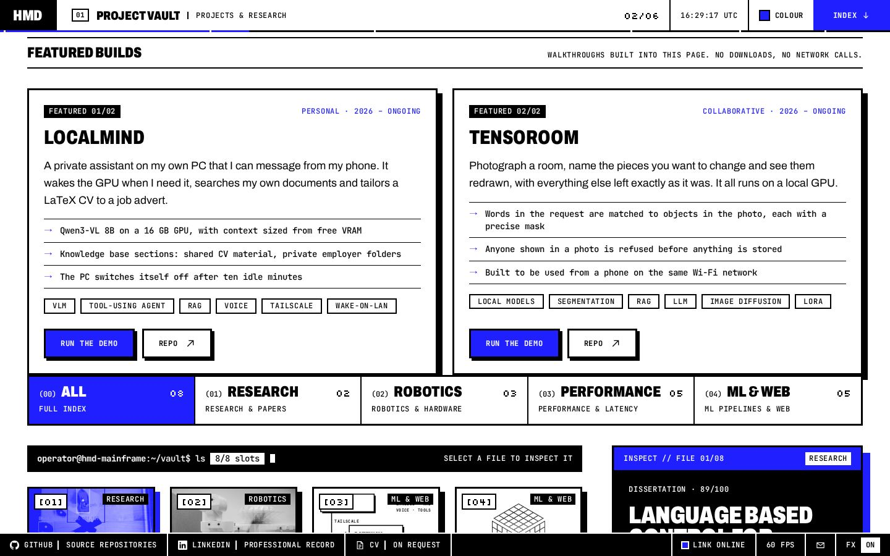 | 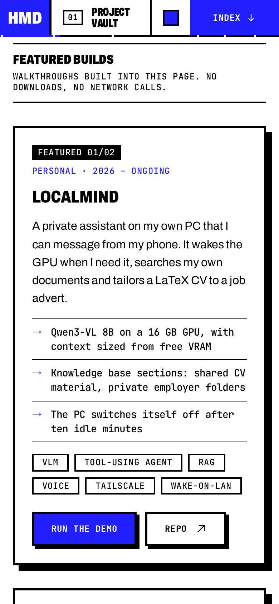 |

### LocalMind demo

Six steps: the chat home screen, pasting a job advert, the tool calls, the answer with a PDF, the knowledge base sections, and messaging the PC from a phone.

| | |
|---|---|
| 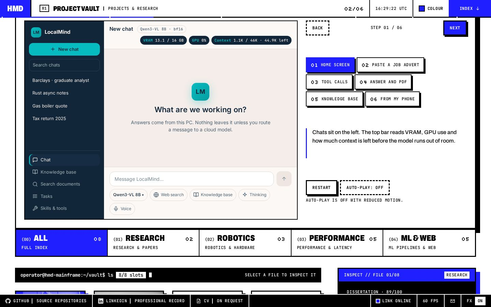 | 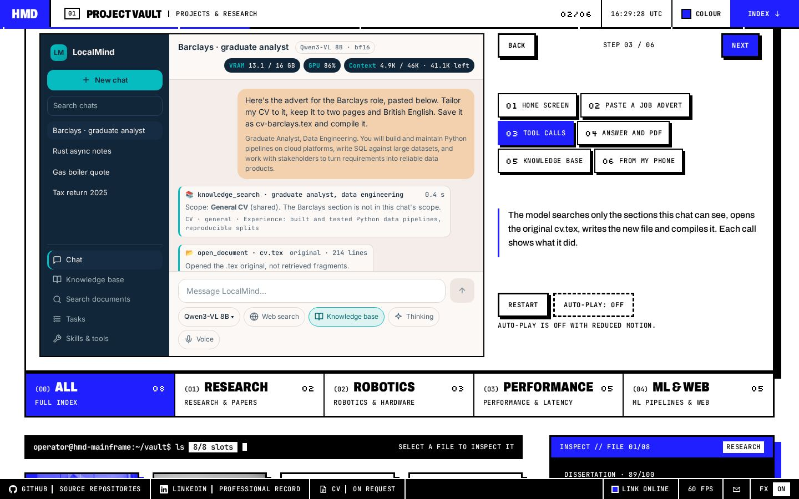 |
| 01 · Home screen | 03 · Tool calls |
| 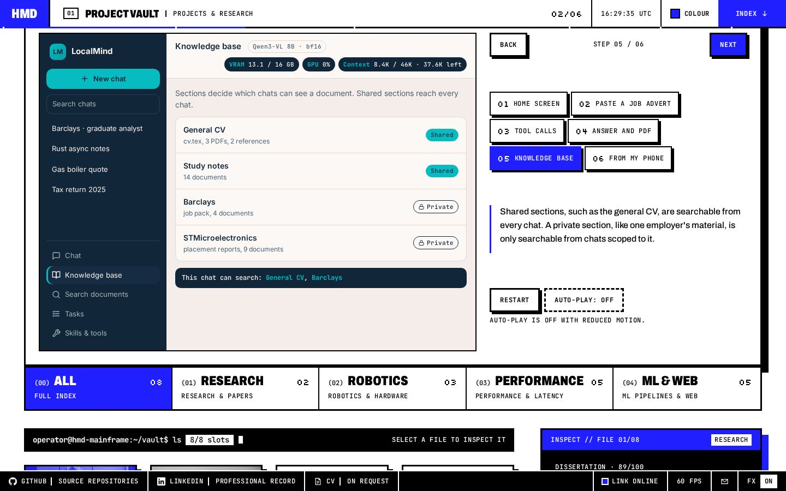 | 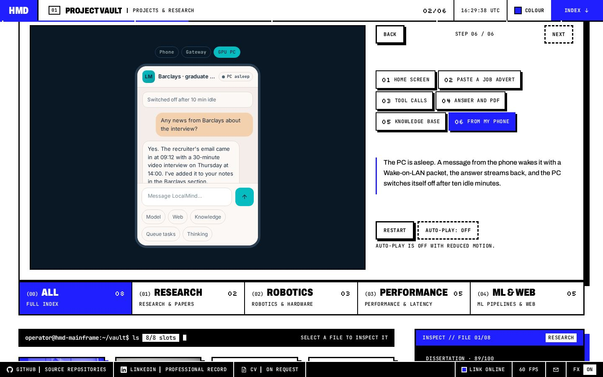 |
| 05 · Knowledge base | 06 · From my phone |

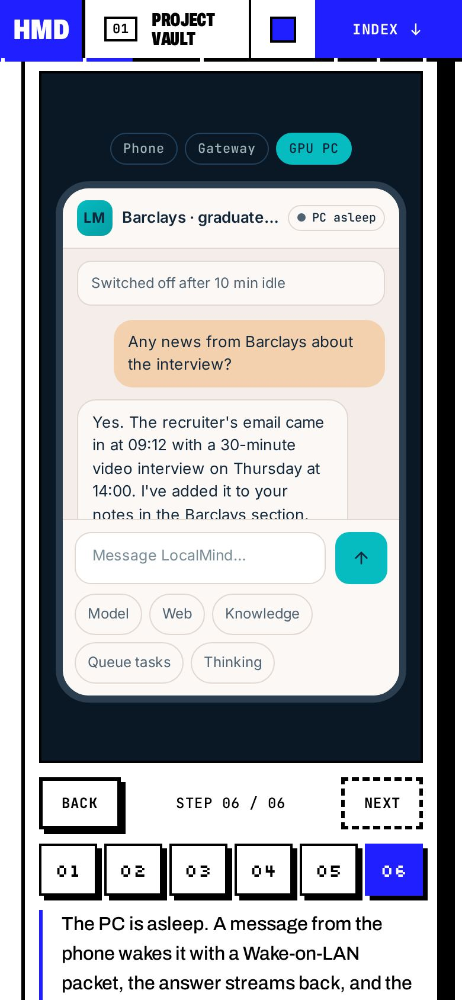
 Step 06 on a phone

### TensoRoom demo

Five steps, in the app's own phone layout: your room, what to change, choose and describe, redraw, and a before/after comparison using real renders.

| | | | |
|---|---|---|---|
| 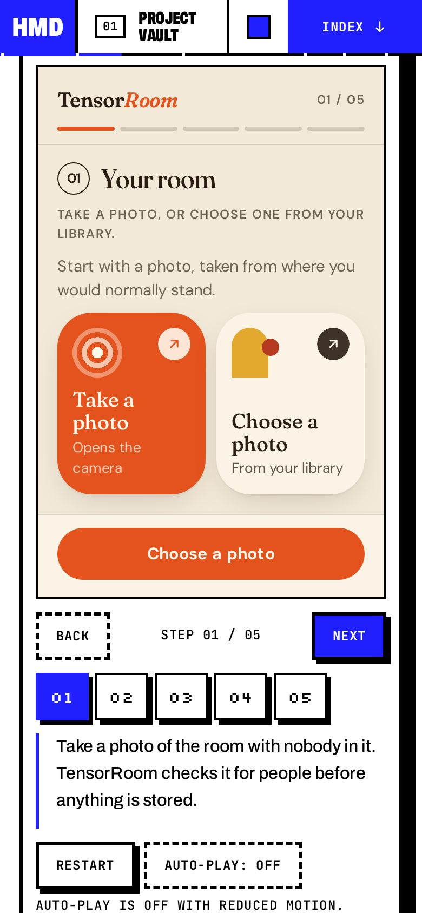 | 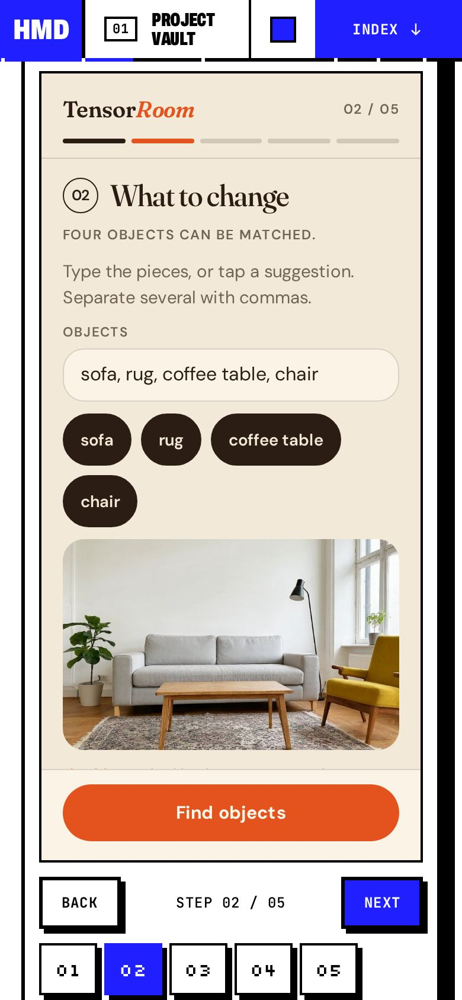 | 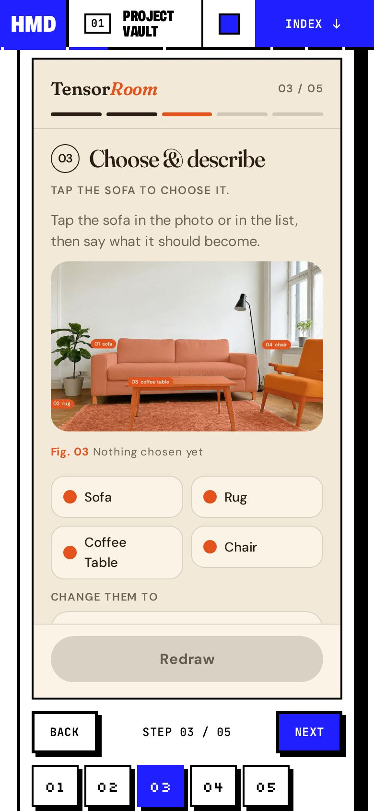 | 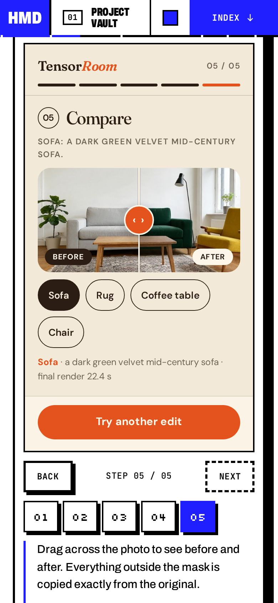 |
| 01 · Your room | 02 · What to change | 03 · Choose & describe | 05 · Compare |

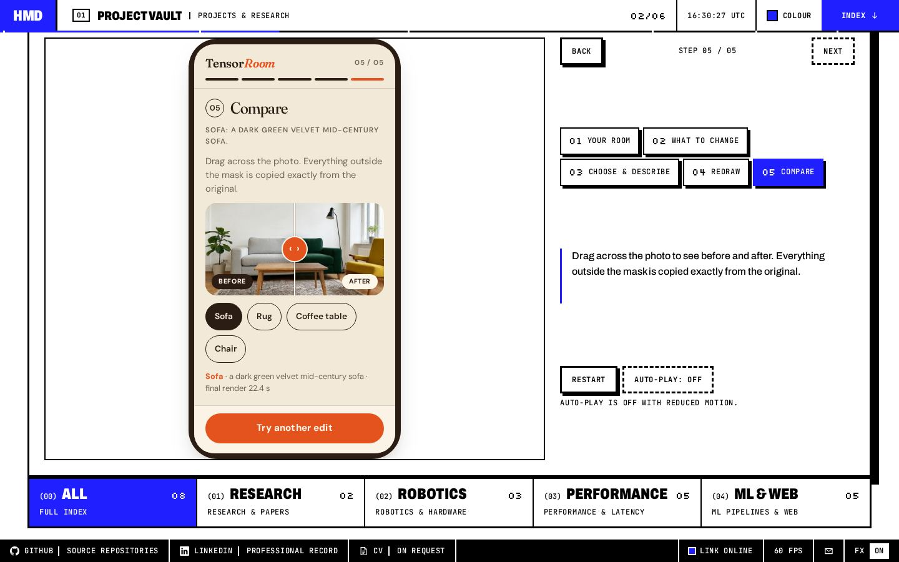
 Step 05 on desktop

## Where it lives

- `src/components/featured/`: the block (`FeaturedProjects.js`), the step engine (`DemoStage.js`) and one module per demo in `demos/`.
- `public/featured/tensoroom/`: the room photos the TensoRoom demo uses.
- To feature another project, add a `featured` entry to it in `src/components/projectdata.js` and register a demo module in `FeaturedProjects.js`.
- `docs/preview/`: the screenshots above. They aren't part of the built site.

---

# Getting Started with Create React App

This project was bootstrapped with [Create React App](https://github.com/facebook/create-react-app).

## Available Scripts

In the project directory, you can run:

### `npm start`

Runs the app in the development mode.\
Open [http://localhost:3000](http://localhost:3000) to view it in your browser.

The page will reload when you make changes.\
You may also see any lint errors in the console.

### `npm test`

Launches the test runner in the interactive watch mode.\
See the section about [running tests](https://facebook.github.io/create-react-app/docs/running-tests) for more information.

### `npm run build`

Builds the app for production to the `build` folder.\
It correctly bundles React in production mode and optimizes the build for the best performance.

The build is minified and the filenames include the hashes.\
Your app is ready to be deployed!

See the section about [deployment](https://facebook.github.io/create-react-app/docs/deployment) for more information.

### `npm run eject`

**Note: this is a one-way operation. Once you `eject`, you can't go back!**

If you aren't satisfied with the build tool and configuration choices, you can `eject` at any time. This command will remove the single build dependency from your project.

Instead, it will copy all the configuration files and the transitive dependencies (webpack, Babel, ESLint, etc) right into your project so you have full control over them. All of the commands except `eject` will still work, but they will point to the copied scripts so you can tweak them. At this point you're on your own.

You don't have to ever use `eject`. The curated feature set is suitable for small and middle deployments, and you shouldn't feel obligated to use this feature. However we understand that this tool wouldn't be useful if you couldn't customize it when you are ready for it.

## Learn More

You can learn more in the [Create React App documentation](https://facebook.github.io/create-react-app/docs/getting-started).

To learn React, check out the [React documentation](https://reactjs.org/).

### Code Splitting

This section has moved here: [https://facebook.github.io/create-react-app/docs/code-splitting](https://facebook.github.io/create-react-app/docs/code-splitting)

### Analyzing the Bundle Size

This section has moved here: [https://facebook.github.io/create-react-app/docs/analyzing-the-bundle-size](https://facebook.github.io/create-react-app/docs/analyzing-the-bundle-size)

### Making a Progressive Web App

This section has moved here: [https://facebook.github.io/create-react-app/docs/making-a-progressive-web-app](https://facebook.github.io/create-react-app/docs/making-a-progressive-web-app)

### Advanced Configuration

This section has moved here: [https://facebook.github.io/create-react-app/docs/advanced-configuration](https://facebook.github.io/create-react-app/docs/advanced-configuration)

### Deployment

This section has moved here: [https://facebook.github.io/create-react-app/docs/deployment](https://facebook.github.io/create-react-app/docs/deployment)

### `npm run build` fails to minify

This section has moved here: [https://facebook.github.io/create-react-app/docs/troubleshooting#npm-run-build-fails-to-minify](https://facebook.github.io/create-react-app/docs/troubleshooting#npm-run-build-fails-to-minify)
